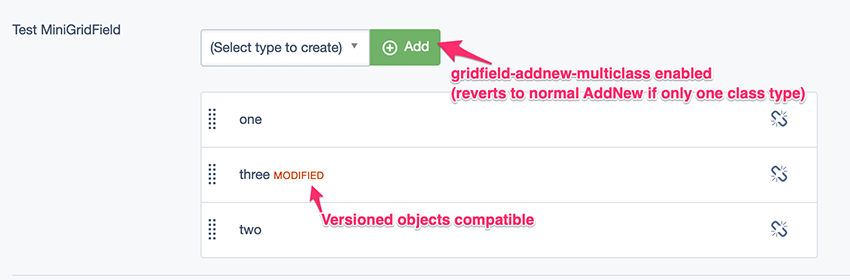
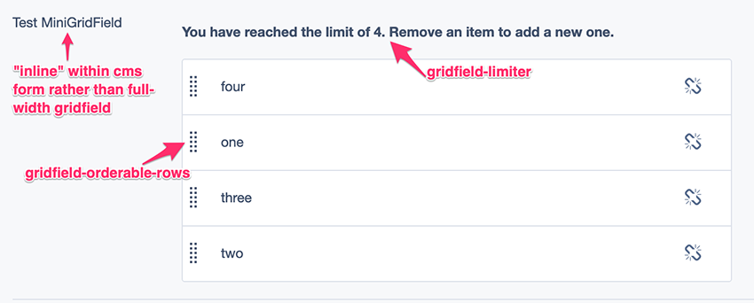

# silverstripe-minigridfield

A field that preconfigures and gently themes a `GridField` to result in a "mini" inline grid field.

Two field types are included:

* `MiniGridField`
* `HasOneMiniGridField` - use this to manage an object in a has_one relation

Auto-magically handles (preconfigures, with a few flags available to devs) orderable rows, add new multi class, versioning.

## Requirements

* [silverstripe-framework](https://github.com/silverstripe/silverstripe-framework) ^4.2
* [symbiote/silverstripe-gridfieldextensions](https://github.com/symbiote/silverstripe-gridfieldextensions) ^3.0
* [fromholdio/silverstripe-gridfield-limiter](https://github.com/fromholdio/silverstripe-gridfield-limiter) ^1.0

## Installation

`composer require fromholdio/silverstripe-minigridfield`

## Detail

Detail and usage examples to come.

## Screenshots

## Complete Example

This is an example showing a has one, has many and many many:

    use Fromholdio\MiniGridField\Forms\HasOneMiniGridField;
    use Fromholdio\MiniGridField\Forms\MiniGridField;
    use SilverStripe\Admin\ModelAdmin;
    use SilverStripe\ORM\DataObject;

    class TestAdmin extends ModelAdmin {
        private static $menu_title = 'Test';
        private static $url_segment = 'test';
        private static $managed_models = [
            Radio::class,
            Owner::class,
            Presenter::class,
            Listener::class,
        ];
    }

    class Radio extends DataObject {
        private static $db = ['Title' => 'Varchar'];
        private static $has_one = ['Owner' => Owner::class];
        private static $has_many = ['Presenters' => Presenter::class];
        private static $many_many = ['Listeners' => Listener::class];
        public function getCMSFields() {
            $fields = parent::getCMSFields();

            $fields->replaceField('OwnerID', HasOneMiniGridField ::create('Owner', 'Owner', $this));

            $fields->removeByName('Presenters');
            $fields->insertAfter('Title', MiniGridField::create('Presenters', 'Presenters', $this));

            $fields->removeByName('Listeners');
            $fields->insertAfter('Title', MiniGridField::create('Listeners', 'Listeners', $this));

            return $fields;
        }
    }

    class Owner extends DataObject {
        private static $db = ['Title' => 'Varchar'];
        private static $has_many = ['Radio' => Radio::class];
    }

    class Presenter extends DataObject {
        private static $db = ['Title' => 'Varchar'];
        private static $has_one = ['Radio' => Radio::class];
    }

    class Listener extends DataObject {
        private static $db = ['Title' => 'Varchar'];
        private static $belongs_many_many = ['Radios' => Radio::class];
    }

## Thanks & Acknowledgements

* https://github.com/silvershop/silverstripe-hasonefield
* https://github.com/satrun77/silverstripe-hasoneselector
* https://github.com/gorriecoe/silverstripe-linkfield

There are a few more, can't find them right now, will list them here soon. I've worked hard on getting this working how I want it, but took direction from some of the wonderful peeps and their code above, thanks.
